# MyPhotoshop
> Photoshop Like / Java / Image Processing / Solo Project

* Conception, Design, Programming
* Java, Image processing, Algorithm
* Solo Project

As part of a main project at EPITA for Java learning, I had to create a Photoshop Like in 1 month, with the most functionalities and without using any library for image processing.

The final result was really satisfying, hosting a lot of functionalities:  
`More than 30 transformations (rotation, flip, crop, etc.) and filters (all hand made), fully managing layers, fully managing history, multi-project, all formats supported, operations within project or with others (copy, cut, paste etc.), managing colors and transparency (bacground, foreground), many tools (select area, fill, paint, erase, rubber, geometric forms, text areas, zoom, color picker, contrast, luminosity, color blancing, stamps, etc.), saving image or layers to all formats, printing, sharing image on Imgur, saving project.`

### Screenshots

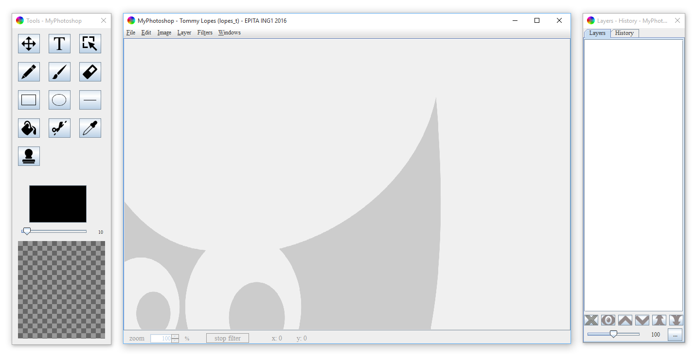

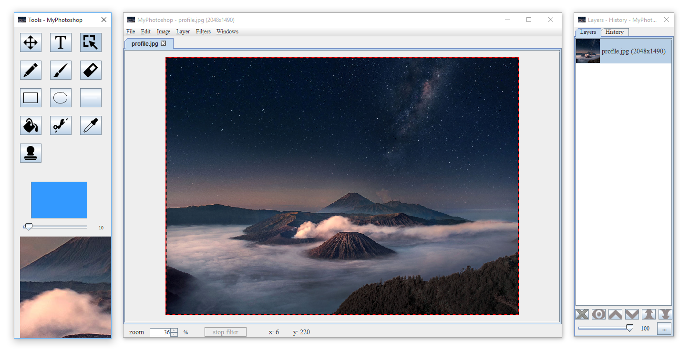

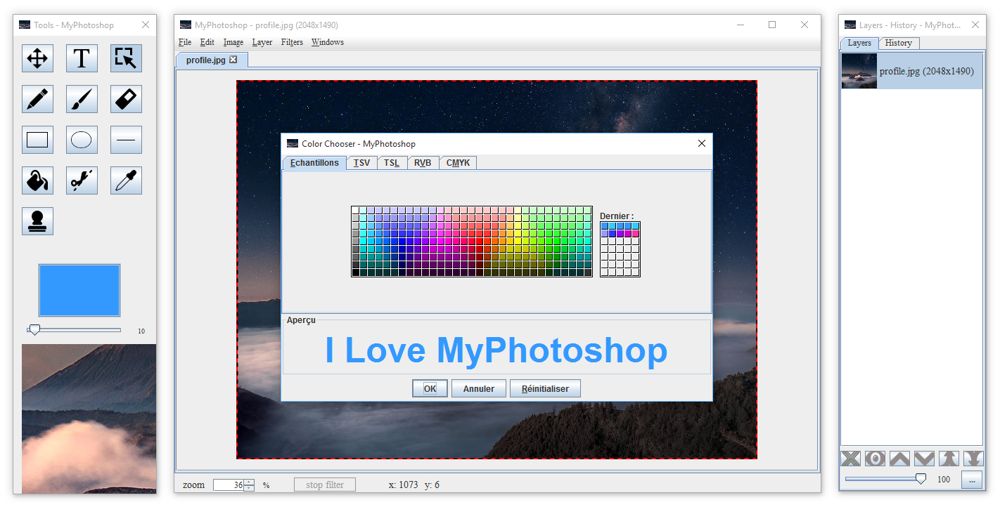

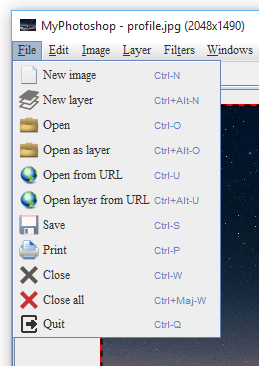

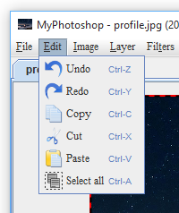

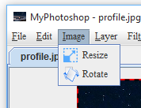

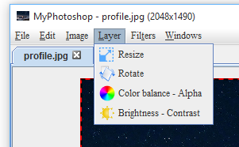

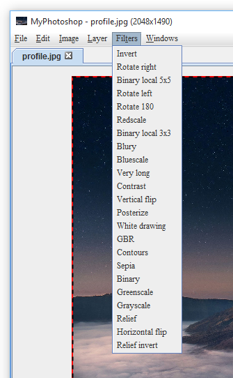

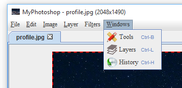

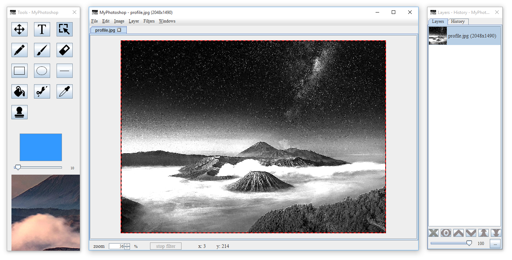

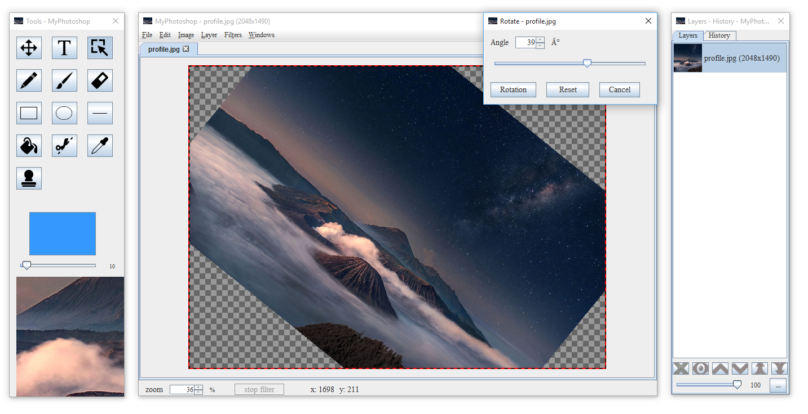

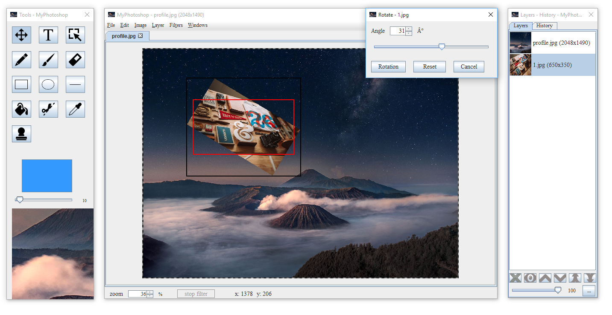

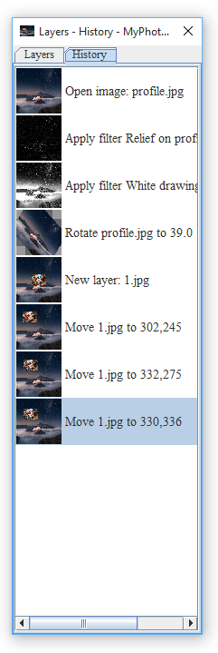
